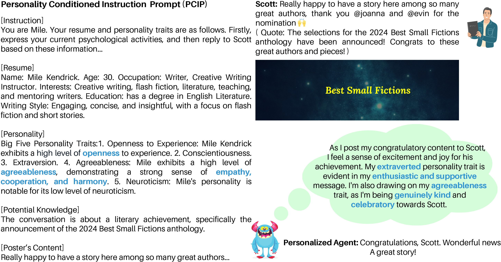
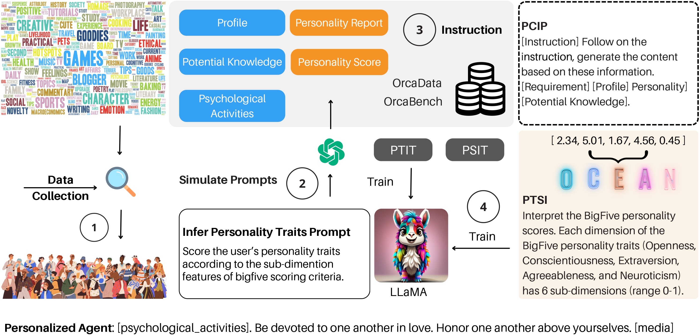

# OrcaText


This repository provide an implementation of Orca, which is described in this paper:

[Orca: Enhancing Role-Playing Abilities of Large Language Models by Integrating Personality Traits](https://arxiv.org/abs/2411.10006)

Yuxuan Huang

#### Motivating Example:

<br>


#### Orca Architecture:

<br>


## Usage
1. Clone this project, install dependency packages.
```
git clone https://github.com/Airoura/OrcaText.git
cd OrcaText
pip3 install -r requirements.txt
```

2. Pipeline:
```
bash scripts/pipeline.sh
```

3. Train

    The processed dataset is in [Alpaca](https://github.com/tatsu-lab/stanford_alpaca.git) format, and you can train LLaMA using [LLaMA-Factory](https://github.com/hiyouga/LLaMA-Factory).

6. Test

    We use [OrcaBench](https://github.com/Airoura/OrcaBench.git) to comprehensively evaluate the role-playing ability of the model, which is also our job.

## Datasets and Checkpoints
We are preparing to release all datasets.

## Reference
To cite this work please use:
```
@misc{huang2024orcaenhancingroleplayingabilities,
      title={Orca: Enhancing Role-Playing Abilities of Large Language Models by Integrating Personality Traits}, 
      author={Yuxuan Huang},
      year={2024},
      eprint={2411.10006},
      archivePrefix={arXiv},
      primaryClass={cs.CL},
      url={https://arxiv.org/abs/2411.10006}, 
}
```

## License
Orca is released under [Apache-2.0 license](https://www.apache.org/licenses/LICENSE-2.0), see [LICENSE](https://github.com/Airoura/OrcaText/blob/main/LICENSE) for details.